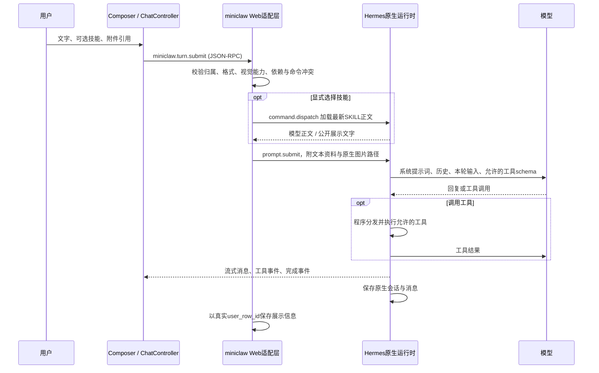

# 基础 Agent：使用与实现

本次按“先把聊天基础做可用”的目标完成。主界面用于日常任务；Skills、工具、记忆放入设置，上下文诊断留在开发者页。智能路由与敏感拦截等待用户共同设计，代码没有实现这两项。

## 可以怎样用

1. 新建对话，直接聊天；Enter发送，Shift+Enter换行，中文输入法确认候选不会提交。生成期间可以停止，也可以先写下一条草稿。
2. 侧栏搜索旧对话、改名、加载更早记录，或归档；归档记录可以恢复。不同会话有独立的未发送草稿，刷新后仍保留在本机浏览器。
3. 从输入框“选择技能”选择本次处理流程，再填写具体任务。默认只列当前可用的技能，“全部技能”说明缺工具、待核对或未启用的原因。
4. 设置→技能可以添加、导入单个SKILL.md、编辑、启停和重新扫描。保存时声明工具依赖；只总结已给出的文字可以不选工具。正文变化后需要重新核对依赖。
5. 设置→工具选择受限能力，新建对话后生效。列表分别显示“配置开启”与“本对话实际加载”，避免将开关当作已经授予当前Agent的权限。
6. 输入框加号支持PNG/JPEG/WebP与UTF-8 TXT/Markdown；也支持粘贴图片、把文件拖到输入框。可以预览、移除，再随消息发送。刷新历史会恢复附件卡片。
7. 设置→记忆可以手动维护长期事实和个人偏好。保存内容与开启加载是两个动作；配置开关在新对话生效。默认维持原来关闭的状态。

阅读旧回复时，流式输出不会持续把页面拉回底部；“回到最新消息”恢复跟随。失败发送保留草稿。断线或提交超时不自动重发，应先恢复会话核对结果，避免工具重复执行。

空会话可能在第一条消息发送前尚未落入原生数据库。此时若重启后端导致旧运行会话丢失，页面创建替代会话，并在渲染前迁移文字草稿与技能选择；附件仍属于原会话，需要重新上传，界面会明确提示。已发送会话正常恢复原归属的附件。

图片编辑后续增加了单独的保存路径：第一次手动修图接受前会建立原生会话记录，因此不发聊天消息也能恢复修图版本，详见[图片编辑实现](image-editing.md)。仅上传而未聊天或修图的空会话仍遵守上面的限制。

## 一条消息的真实路径



模型选择工具调用，Python程序执行工具；Skill是一组工作指令，不是新工具，也不是一份权限授权。前端不拼接Skill全文，不运行脚本。服务端提交前再次检查，浏览器的可用提示不能替代后端校验。

消息公开展示与模型输入不同：聊天气泡显示原任务、技能名称和附件卡片；模型输入包含原生Skill分发后的正文和文本附件资料。两者通过Hermes返回的真实消息行ID对应，不按字符串猜测匹配。

## 文件入口

| 文件 | 负责什么 |
|---|---|
| `frontend/src/App.tsx` | 主聊天布局、阅读时滚动跟随、设置入口 |
| `frontend/src/Composer.tsx`、`drafts.ts` | 输入、IME、草稿、技能选择、附件上传 |
| `frontend/src/chat-controller.ts` | 会话状态、发送/停止、断线恢复、历史与展示信息合并 |
| `frontend/src/SkillEditor.tsx`、`ToolPreferences.tsx` | 添加技能、依赖核对、工具配置与实际加载状态 |
| `frontend/src/MemoryEditor.tsx` | 长期事实与个人偏好的手动编辑 |
| `scripts/web_entry.py` | 保留原生dashboard启动生命周期，挂载项目适配层 |
| `miniclaw_web/runtime.py` | 同源REST、提交RPC、Skill/工具/记忆规则 |
| `miniclaw_web/attachments.py` | 附件解码、真实格式/大小/编码校验、模型材料 |
| `miniclaw_web/store.py` | 附件、展示信息、依赖的辅助SQLite存储 |
| `miniclaw_web/context.py` | 固定上游版本的Skills用量分类兼容修正 |
| `plugins/miniclaw-files/` | 受限资料读取、独占创建文本产物 |

Hermes的Agent loop、模型客户端、流式协议、原生会话数据库、技能分发和上下文压缩继续复用。没有复制第二套Agent循环，也没有修改固定上游生产源码。入口使用现有认证和Origin检查；新增路由在SPA兜底之前挂载。

## Skills：安装、启用、索引、正文、执行

这五件事需要分别验证：

- **安装**：磁盘上有SKILL.md，并通过原生Skills扫描、兼容性和内容检查。
- **启用**：配置允许该技能参与使用；停用后，前端和服务端发送检查都拒绝它。
- **索引**：开启“让模型查阅技能”工具组后，新Agent拥有skills_list/skill_view，原生系统提示词才加入名称与描述索引。全部已安装正文不会一次性塞进上下文。
- **正文加载**：用户显式选择时，服务端用原生command.dispatch；模型自行查阅时使用skill_view。两条路径都不增加权限。
- **执行**：当前Agent真实工具schema必须包含声明的依赖，脚本、系统依赖还需维护者验证。依赖声明不证明所有环境条件都满足。

本机默认保留两项只读工具，所以自动索引默认不注入；显式选择并核对过的纯文本流程可以使用。希望模型自行发现技能时，开启对应读取组并新建对话。

依赖绑定存于辅助数据库，目前契约为：

```json
{
  "version": 1,
  "required_tools": ["miniclaw_save_artifact"],
  "content_hash": "SKILL.md正文的SHA256"
}
```

读取时额外返回`current`，表示声明是否仍对应当前正文。依赖必须是后端已知工具名；绑定终端不会使终端出现在Agent的schema中。正文编辑和依赖声明采用版本检测，旧内容提交得到409，界面要求重新打开核对。项目接口中的编辑串行化不能保证未经该接口的任意外部编辑器与保存完全原子同步。

这个版本化结构是未来接入工具注册表、MCP或其他平台的接点。没有拿到用户所说aiwa的具体仓库/协议，因此没有宣称与它兼容，也没有实际接入。接入时需明确其工具身份、权限来源、安装方式与运行条件，并扩展后端目录；不能只换前端名称。

添加支持单个Markdown指令文件，暂不提供市场、Git仓库下载、ZIP脚本包安装或依赖自动安装。PDF/Word/Excel/幻灯片类技能仍需要执行工具和环境，这次没有开放任意终端；它们会说明缺项，而不是假装可以生成。

新增时，技能标识会同步更新模板frontmatter的name；后端创建/编辑检查两者一致，避免文件目录与扫描目录的名称不同而出现“保存成功却找不到技能”。无法通过原生编辑入口解析的外部技能保留待核对状态，不使整个清单加载失败。

## 工具的边界

| 组 | 工具 | 默认 |
|---|---|---|
| 资料读取 | miniclaw_list_files、miniclaw_read_file | 开启、基础组保留 |
| 保存文本产物 | miniclaw_save_artifact | 关闭，可选 |
| 让模型查阅技能 | skills_list、skill_view | 关闭，可选 |
| 图片编辑 | miniclaw_image_list、miniclaw_edit_image、miniclaw_image_status | 关闭，可选 |

工具设置写入原生`platform_toolsets.cli`，再更新既有`HERMES_TUI_TOOLSETS`固定列表，供新Agent构建。既有Agent保留其真实工具集合。配置写入保留原始YAML中的环境变量引用，不把展开的凭据保存到配置。遇到额外运维工具配置时，基础界面拒绝覆盖。

文本产物工具只在配置的工作区`artifacts/`内创建TXT/Markdown/JSON/CSV，UTF-8最大64 KiB，文件名校验、不覆盖已有文件、不执行命令。成功结果的相对路径对应认证下载接口，聊天中显示下载入口。它不能完成PDF脚本任务。

开启技能读取前要求`skills.inline_shell`关闭，显式分发也拒绝已知内联终端预处理。当前应用仍是受信任的本机个人工作区，工具限制不等于操作系统沙箱或完整多用户权限系统。

## 附件怎样进入模型与历史

浏览器上传到本机服务只返回附件ID和显示元数据；发送前可以查看或移除。点击发送才会把附件材料交给已配置的模型服务。文本作为用户资料附加；图片通过Hermes原生图片路由构造多模态内容。

后端按真实图像内容校验扩展名，图片最大5 MiB/2000万像素；文本最大64 KiB且必须UTF-8、非空、无NUL。每轮最多4个文件，文本合计最大128 KiB。未声明原生视觉能力且没有图片编辑工具时拒绝图片发送；已有图片编辑工具时可传图片ID执行明确操作，明确说明聊天模型无法看图，不把工具编辑冒充模型视觉。

上传内容中的原生`@file:`、`@url:`、`@git:`等上下文引用标记在模型资料中转换为全角＠，防止附件自行触发模型调用前的文件读取、网络获取或Git展开。下载原文保持原字节。资料仍可能包含误导性文字；这种边界处理不是本次暂缓的“敏感拦截”，也不保证模型不会受提示注入影响。

新增`.hermes/miniclaw.sqlite3`最初有三张表：`attachments`（归属和文件元数据）、`turns`（原消息行ID与公开展示材料）、`bindings`（技能依赖）；图片编辑增加第四张`image_jobs`（状态、请求幂等与版本关系）。Hermes的`state.db`仍是会话/消息权威来源。SQLite连接显式关闭，事务上下文本身不负责关闭连接。

历史恢复时，先取原生投影与工具结果，再按消息行ID补回展示材料和附件卡片。辅助显示保存失败发生在消息被原生接受之后时，返回“已发送，显示记录保存失败”的警告，避免邀请用户重复发送。

移除附件仅取消本轮引用，不永久删除服务器文件。当前没有总磁盘配额、过期附件清理、跨浏览器草稿同步、压缩祖先附件浏览。长期使用需要另行设计保留和清理策略；不能把该归属检查当作多人账户隔离。

## 短期记忆、长期记忆与压缩

短期记忆是当前会话的原生历史与Agent运行状态，保存在原生数据库；新对话开启新的历史。前端草稿不属于模型记忆。上下文达到边界时，由Hermes压缩逻辑处理；实现与练习继续见[上下文实战](context-learning.md)。

长期事实存于`.hermes/memories/MEMORY.md`，个人偏好存于`USER.md`。本次补了人工编辑：使用原生文件锁、旧正文hash检查和原子写入；超出原生字符预算会拒绝保存。保存文件不自动开启注入，配置开关在新对话应用。当前工具组未开放模型自动写记忆，也没有向量数据库或RAG检索。

记忆编辑区还显示本对话的实际快照状态，来自Agent启用标记及MemoryStore的`format_for_system_prompt`，不向浏览器返回提示词里的记忆正文。原生快照在加载时冻结；修改磁盘内容不会直接替换旧Agent的快照，压缩重建或新Agent加载才更新。这与“文件已保存”“新会话配置已开启”分别显示。

上游固定提交的Skills索引已从stable提示词层移到volatile层，但分类估算仍只搜索stable。适配层修正该显示归属，从系统提示词估算中转移相应部分到Skills；总估算及provider用量不变，不修改模型内容。分类token仍是粗估，不是提供方的逐段精确计费。升级上游需重新评估这个兼容修正。

## 已验证什么

- TypeScript/Vite生产构建；27项前端行为检查。其中8项使用ReactDOM/jsdom执行组件事件，覆盖IME/Shift+Enter、附件粘贴/拖放/移除/仅附件发送、迟到上传的会话边界、发送拒绝保留输入、页面内未保存保护、Skill导入/声明/重扫、记忆实际快照说明、阅读时暂停自动滚动。它们使用API响应替身，实际认证/数据库/Agent另外验证；DOM测试不证明操作系统剪贴板与文件下载行为。
- 14项基础API检查：附件真实格式/归属/编码、文本资料、原生图片分支、依赖不能扩权、编辑失效、命令冲突、记忆并发版本与快照状态、受限创建与下载、接受后显示写入失败、Skills分类修正、技能身份一致性。
- 原有文件插件2项成功/10项拒绝和SQLite重开。
- 真实WS新建Agent：仅加载选择的5个工具schema，Skills索引分类约1293个估算token。检查后恢复原配置。
- 真实新Agent的长期事实/个人偏好加载：写入虚构测试资料、开启两项加载，新Agent实际快照均为已加载，上下文Memory分类约193个估算token；检查后核对原内容hash和加载开关均已恢复，未调用模型。
- 一次真实技能＋工具闭环：新增学习笔记流程，声明保存工具依赖，模型调用工具生成Markdown，消息展示信息对应原始user_row_id。
- 真实浏览器：图片＋Markdown上传、预览、发送、刷新历史；文本测试代号被模型读取。图片进入原生链路，但模型对蓝色色块描述不准确，不能据此声称视觉任务准确。
- 真实浏览器添加、声明并选择商品摘要技能，得到预期的事实/待确认格式；模型还引用了同会话先前的附件事实，说明历史会影响回答，不能把流程指令当作强制数据隔离。
- 真实浏览器草稿隔离、切回与刷新、归档/恢复；桌面和320px技能选择、添加表单没有横向溢出。

后续真实浏览器复验已恢复：未编辑的新模板直接退出，修改后显示页面内确认面板，“继续编辑”保留修改，“放弃修改”退出；320px确认面板无横向溢出。记忆页实际显示当前对话未加载与保存不自动开启的区别。通过浏览器剪贴板粘贴PNG后上传并显示预览，移除引用成功；Shift+Enter换行没有发送。操作系统拖入和中文输入法组合过程仍只有组件事件证据。

产物已通过认证接口读取并生成下载链接；内置浏览器的下载事件和downloadMedia没有返回文件路径，没有确认其根因。之后用户明确回复“我已经看到了下载的结果”，完成下载验收。没有绕过浏览器控制机制；操作系统拖入和中文输入法仍只有组件事件证据。后续图片编辑的新增验证单独记录在[图片编辑实现](image-editing.md)，上述27/14项为基础版发布时的检查数量。

```powershell
# 不调用模型
.\scripts\miniclaw.ps1 test
.\scripts\miniclaw.ps1 build

# 服务已启动：暂时开启受限组，核对真实Agent后恢复配置
.\.venv\Scripts\python.exe .\scripts\verify_basic_live.py

# 可选：会调用模型，留下独立测试会话、技能和学习笔记文件
.\.venv\Scripts\python.exe .\scripts\verify_basic_live.py --model

# 可选：只允许两份记忆都为空的profile；临时写虚构资料与开关，验证后恢复
# 不调用模型；如果原文件不存在，会留下初始化的空记忆文件
.\.venv\Scripts\python.exe .\scripts\verify_memory_live.py
```

## 明天可以逐项追问

1. 前端发消息时，文字、技能名称和附件ID分别去了哪里？为什么不在浏览器拼接Skill全文？
2. 安装、启用、索引、正文加载、真实工具权限为什么是五个不同状态？
3. 一个Skill声明需要工具，为什么不能自动得到该工具？正文hash在解决哪种错误？
4. 为什么工具配置要求新建会话？既有Agent的schema在哪里生成？
5. 消息行ID、运行会话ID、持久化会话ID分别有什么用途？为什么新增数据库没有取代原数据库？
6. 草稿、短期记忆、长期事实、个人偏好、压缩摘要为什么不能混为一谈？
7. 真实模型、离线处理器测试、前端行为测试分别证明了什么，没证明什么？

路由的流程选择、敏感分级与问询策略继续按用户共同设计后实施。
