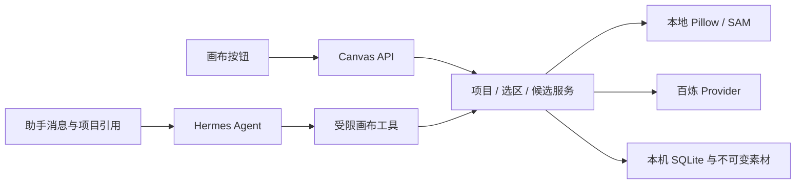

# 独立图片项目与画布

图片工作区是 miniclaw 内的第二个应用模块。项目可以单独创建，也可以关联聊天。Chat和画布共用本机服务、认证、附件存储和百炼配置，修图助手复用Hermes Agent。没有另部署一套聊天后端。

## 使用路径

聊天左侧选择「图片工作区」，新建项目并添加PNG、JPEG或WebP。图片最长边4096像素、上传最大5 MiB；导入时按EXIF校正方向，保存独立的PNG素材副本。聊天里的快捷修图窗口保留，并增加「打开完整画布」。

- 图层：图片、文字、矩形与椭圆；拖拽、缩放和旋转，数值属性、显隐、锁定、透明度、复制、删除、层级。文字用显式换行，不自动排版长文。
- 画布：滚轮围绕鼠标缩放，平移、适应/1:1，尺寸、背景，自由或比例裁剪。裁剪拖动结束即保存，可以撤销；需先解锁受影响图层。
- 选区：先选未锁定且可见的图片层，再矩形、套索、笔刷或SAM；增加、擦除、清除、反选。局部调色、透明擦除、提取新层均在本地执行。提取层裁到选区边界，保留原变换后的位置。
- AI：助手面板选择当前选区或整张图片图层，输入要求，生成候选后比较、采用，或另加图层。百炼可能计费；取消只停止本地接收，超时不自动重试。
- 历史：最近101个文档状态，撤销、重做、恢复指定版本、历史与当前合成对比；撤销后新编辑截断重做分支。
- 项目：改名、搜索、归档、恢复和自动保存。手机保留画布，图层、历史和助手通过「图层与操作」抽屉打开。

点选物体先点击「准备SAM点选模型」。首次下载权重，状态就绪后才能点物体。当前实测ONNX CPU，没有宣称GPU推理。服务重启后准备会复用已下载权重。失败明确提示，矩形、套索、笔刷不依赖模型，没有用画圈冒充SAM。

新环境先完成基础安装，再停止本机服务并运行：

```powershell
.\scripts\setup-canvas.ps1
.\scripts\miniclaw.ps1 prepare
.\scripts\miniclaw.ps1 build
.\scripts\miniclaw.ps1 web
```

依赖在项目`.venv`，权重在忽略的`.hermes/models/sam`。`canvas-requirements.txt`固定可选依赖，与Hermes锁文件共享的版本受到约束。更新依赖后用`lock-canvas.ps1`重锁，普通安装不用重新解析。基础setup的uv sync可能移除可选包，之后重新安装canvas依赖。Windows会锁定正在加载的扩展文件，安装脚本检查9120服务并提醒先停止。没有安装系统CUDA或修改上游锁文件。

修图助手需要当前Agent实际加载`miniclaw-canvas`四个工具。「启用画布工具并新建聊天」明确修改后续聊天的受限工具配置、建立新聊天并关联项目；也可通过设置手动选择。既有聊天的schema不被偷偷扩充。`canvas-editor` Skill只在缺失时安装，绑定正文hash与工具依赖。手动画布API不要求先开聊天，也不依赖聊天模型的工具权限。

「用于聊天」合成画布，复制为目标聊天拥有的附件并放进草稿，不自动发送。导出附件携带来源项目ID，从它再次打开完整画布会回到原项目。关联/回填首次使用时调用Hermes原生落库入口，确保未发消息的聊天也能在关闭、重启后恢复。

## 代码分工

| 代码 | 职责 |
| --- | --- |
| `frontend/src/AppShell.tsx` | 模块切换、保持聊天草稿、惰性加载画布JS |
| `CanvasApp.tsx`、`CanvasStage.tsx` | 项目、编辑交互、Konva预览、图层/历史/助手 |
| `canvas-api.ts` | 业务文档类型、认证HTTP、上传与合成下载 |
| `miniclaw_web/canvas_document.py` | 严格文档校验、仿射变换、Pillow合成 |
| `canvas.py` | 项目/历史事务、真实选区、本地编辑、AI候选与采用 |
| `canvas_routes.py` | 手动API，沿用认证与Origin限制 |
| `segmentation.py` | 官方rembg公共接口、准备状态、CPU SAM |
| `canvas_tools.py`、插件、`runtime.py` | 可信本轮快照、实际schema检查、Skill与Hermes调用 |

功能独立实现，没有复制参考项目应用源码，也没有移入其Postgres、Redis、S3、LangGraph架构。出处与库许可见`THIRD_PARTY_NOTICES.md`。

## 文档、坐标与保存

保存业务JSON，不序列化整个Konva Stage。`schema_version=1`文档含画布尺寸、背景和图层。x/y是画布像素，scale_x/scale_y是倍率，rotation为顺时针角度，图片指向不变的asset_id。显示镜头的缩放和平移不进入文档。

项目在辅助`miniclaw.sqlite3`保存，附件owner为`project-<项目ID>`，原生Chat仍在Hermes `state.db`。最多40层、画布16..4096像素；边界验证JSON体积、有限数、路径点数、颜色、类型与素材归属。本版是单人本机profile，不是多人账户隔离。素材文件没有自动过期清理和总磁盘配额。

`revision`控制并发，`cursor`表示历史位置。撤销时cursor回退，revision仍增加。写入带预期revision，在SQLite `BEGIN IMMEDIATE`事务内比较再更新。冲突返回409，前端恢复最新版本，不重放修改。拖拽结束保存一次，保存清掉旧选区。

浏览器路径先去掉镜头平移与缩放，得到画布坐标；服务端在画布绘路径，再按目标层矩阵映射到原始图片像素。源像素 `(u,v)` 对应：

```
x = cos(theta) * scale_x * u - sin(theta) * scale_y * v + layer.x
y = sin(theta) * scale_x * u + cos(theta) * scale_y * v + layer.y
```

SAM点击用逆变换。蒙版绑定revision、layer_id、asset_id和源图hash，每次重画还有独立selection_id；错层、旧版本、源图或选区变化均拒绝。不会把旧框选拉伸到整幅图片。本机文字预览与导出用微软雅黑和显式行距；其他系统需要可用CJK字体，跨系统字体和抗锯齿不能保证逐像素一致。

## AI与Agent

百炼沿用`image_provider.py`、本机Key和官方端点限制。所选接口没有原生mask参数：局部任务取蒙版边界附近的图像上下文交给Qwen，拿回结果后调整到同样尺寸，再在本地通过mask合成。羽化只向选区内部减弱，硬选区外像素保持相同。像素保护不等于AI语义质量保证，需要用户比较候选。[百炼接口](https://www.alibabacloud.com/help/zh/model-studio/qwen-image-edit-api)

AI任务固定文档、源层、蒙版与revision，2个后台线程、全局4个活动任务、每项目一个。相同request_id和参数返回原任务，换参数拒绝。重启中断任务标为未知失败，不再次收费。成功只发布候选，采用时再次检查revision和源层；用户改过画布后，只能另加候选图层，不能迟到覆盖。

画布助手仍用Hermes Agent。提交传`canvas_context={project_id, revision, layer_id}`，服务端核对聊天关联，再保存可信本轮上下文、选区hash和selection_id。工具必须在实际schema里，模型只能读关联项目摘要、操作本轮目标层的选区、提交候选、查任务。执行期间用户改选区，工具拒绝旧请求。普通Chat提交清掉画布本轮上下文。不会把所有层JSON、图片Base64和mask塞进每个聊天轮次。



## 验证

`miniclaw.ps1 test`包含前端、基础API、图像执行与画布检查。重点覆盖素材归属、有限数、锁定、分支历史、单调revision、旋转/非等比缩放后的选区、选区外RGBA完全相同、透明擦除、候选不覆盖新编辑、幂等、取消/重启不重放。前端覆盖隐藏画布不响应聊天Delete键，以及轮询不抹掉项目名字草稿。

真实服务脚本使用虚构瓶子：

```powershell
.\.venv\Scripts\python.exe scripts\verify_canvas_live.py
.\.venv\Scripts\python.exe scripts\verify_canvas_live.py --sam
# 调聊天模型，以Skill完成本地选区提取，不调百炼
.\.venv\Scripts\python.exe scripts\verify_canvas_live.py --model
# 明确一次付费百炼，检查候选/选区外像素/采用，不自动重试
.\.venv\Scripts\python.exe scripts\verify_canvas_live.py --cloud
```

本机实际验证了SAM CPU选中瓶子、canvas-editor Skill→Agent→画布工具，以及一次百炼候选生成/采用与选区外像素相同。真实浏览器另验上传、图层变换、中文文字、4:5裁剪/撤销、历史对比、刷新恢复、320px布局和画布→聊天草稿→原项目往返。导出API已核对真实PNG与尺寸；点击下载按钮后内置浏览器未提供download事件，不能据此声称本轮已验证操作系统落盘。

智能路由、敏感拦截仍等用户参与设计。批处理、营销编排、自动拆分图层、外网独立部署、多人权限、GPU推理不在本轮范围。

## 可以继续追问

1. 项目ID、聊天关联和素材拥有为什么分开？
2. 业务JSON和Stage有什么差别？界面坐标怎样换算？
3. 撤销后revision为什么还增加？历史编号为什么不够？
4. SAM怎样把点击变成mask？它和框选、画圈有什么差别？
5. 为什么百炼不直接接mask？局部合成怎样保护原图？
6. 为什么先生成候选？超时、取消、重启各是什么意思？
7. Skill怎样绑定工具？关联项目为什么不等于全盘权限？
8. 前端、API、真实模型、真实像素各证明了什么？
