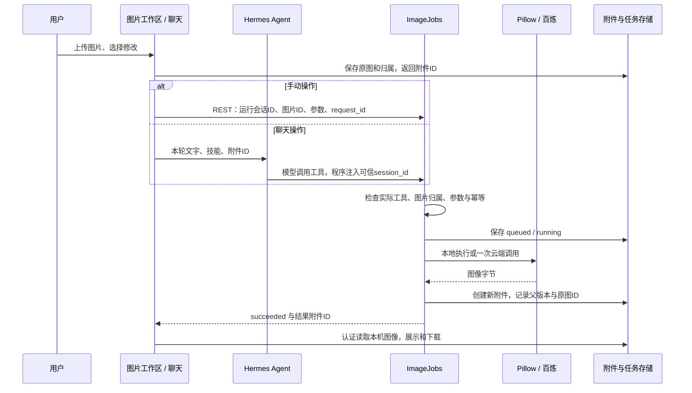

# 图片编辑：从聊天到版本结果

这版接入的是商品修图的第一条完整链路：上传图片，手动编辑或在聊天中选“商品修图”，生成新版本，比较、下载，再从结果继续修改。模型继续使用 Hermes 的 Agent loop；手动按钮和模型工具调用共用同一个执行服务。

参考项目为 [ai-picture-editor](https://github.com/yuyuanweb/ai-picture-editor)，审阅提交 `49f6ad8c96740a68b7e6228a47e8e2be6876eb34`。没有复制该项目应用源码，也没有引入其 LangGraph、Postgres、Redis 或对象存储部署。当前实现不包含完整画布、图层、SAM 选区或全部工具迁移。

## 使用

1. 更新后运行 `miniclaw.ps1 prepare`、`build`，重启服务。prepare 只在技能不存在时安装内置 `product-image-edit`，不会覆盖用户编辑过的同名技能。
2. 设置→工具，开启“图片编辑”，新建对话。旧 Agent 保留原工具集合，设置开关不会直接增加旧会话权限。
3. 顶部“修图”→上传 PNG/JPEG/WebP，选择调色、居中裁剪、旋转、翻转或缩放。输出是新的 PNG，原文件保留；比较区可以直接下载、把结果放回聊天，或继续修改。
4. 聊天也可以上传图片，选择“商品修图”，发送“亮度增加20%”这样的任务。工具卡片会显示前后对比及下载入口。没有视觉能力的聊天模型只能使用图片 ID 执行明确参数，界面与模型材料均说明它不能看懂图片。
5. 修改记录可以选择任意保留版本。即使尚未发送聊天消息，第一次手动修图接受时也会保存原生会话，刷新或关闭重开仍可找回版本。

云端 AI 修图需要在本机 `.hermes/.env` 配置后重启服务：

```dotenv
DASHSCOPE_API_KEY=你的百炼Key
MINICLAW_IMAGE_MODEL=qwen-image-edit-max
MINICLAW_IMAGE_BASE_URL=https://dashscope.aliyuncs.com
```

Key 只由后端读取。AI 修图会把所选图片与指令发给百炼，可能计费；缺 Key 时只禁用 AI 提交，本地编辑正常可用。区域端点及模型须匹配实际账户开通情况；接口参考[百炼图像编辑 API](https://www.alibabacloud.com/help/zh/model-studio/qwen-image-edit-api)。检查商品文字、结构和颜色再使用生成结果，不能保证模型忠实保留。

## 一次请求经过哪里



工具组 `miniclaw-images` 有三个工具：`miniclaw_image_list` 查同会话图片，`miniclaw_edit_image` 提交编辑，`miniclaw_image_status` 查任务。模型不能传宿主路径、任意 URL 或 owner；归属由程序注入的 Agent 会话上下文解析。手动接口也解析运行会话并检查真实工具 schema，不信任浏览器声明的权限。当前本机配置启用了资料读取和图片编辑，新 Agent 实际共五个工具；新安装默认仍只有两项资料读取工具。

`product-image-edit` 是工作指令，依赖这三个工具。绑定沿用 version 1 与正文 SHA256；内置内容完全匹配时才自动使用已核对声明。用户修改后需重新核对，不自动开放权限，也不自动安装终端。

## 任务、版本与失败

`state.db` 仍是 Hermes 会话和消息的权威来源；辅助 `.hermes/miniclaw.sqlite3` 增加 `image_jobs` 表，原有 attachments、turns、bindings 保留。结果附件记录 parent_id、root_id 和 image_job_id，文件不覆盖。手动任务第一次接受前通过原生会话落库入口建立会话记录；自动标题显示日期/时间，重名时使用原生编号，遵守标题唯一约束和用户命名优先级。

任务状态为 queued、running、succeeded、failed、canceled。每会话最多一个活动任务，全局最多八个排队/运行任务，两个执行线程。`owner + request_id` 决定任务 ID，同一请求再次提交返回原任务；同一 request_id 改参数会拒绝。界面超时不自动重发，“核对原请求”使用原请求 ID，避免重复调用。

关闭面板、停止聊天不会自动取消图片任务。单独取消后不再发布迟到结果，云端已经收到的请求可能仍执行和计费。服务重启时未完成任务标为失败、结果未确认，绝不自动重放收费请求；当前没有向百炼查询未知请求的恢复功能。

百炼适配限制 HTTPS 官方端点、无重定向的官方 OSS 图片结果、最多5 MiB/2000万像素，下载结果不携带 API Authorization。原始云端外链与服务端文件路径不发给界面；失败只返回有限错误说明。模型生成结果不属于可靠的像素变换，本地调色等操作则可以验证具体像素与尺寸。

## 代码入口和证据

| 入口 | 用途 |
|---|---|
| `frontend/src/ImageWorkspace.tsx` | 手动参数、任务状态、版本列表、回填聊天 |
| `frontend/src/ImageJobCard.tsx`、`image-api.ts` | 原图/结果比较、认证 Blob、任务轮询 |
| `miniclaw_web/runtime.py` | 手动接口、原生会话落库、聊天图片 ID 适配 |
| `miniclaw_web/images.py` | 参数、归属、幂等、状态、Pillow 与版本生成 |
| `miniclaw_web/image_provider.py` | 百炼协议、有限错误、结果下载 |
| `plugins/miniclaw-files/` | Hermes 工具注册；执行委托给同一 ImageJobs |
| `skills/product-image-edit/SKILL.md` | 可显式选择的商品修图流程 |
| `scripts/verify_images_live.py` | 真实运行会话、上传、像素、下载、恢复与可选模型闭环 |

离线验证包括33项前端检查、17项基础 API 检查、8项图像执行/Provider 检查，以及原资料读取与 SQLite 重开检查。Provider 使用 HTTP MockTransport 证明请求格式和凭据边界，不冒充真实百炼调用。真实 DeepSeek 调用已经完成“选择技能→编辑工具→新 PNG”，核对像素变换、原图字节不变、跨会话拒绝、幂等与认证下载；尚未发送消息的手动会话关闭重开亦通过。

用户配置 Key 后，真实浏览器完成一次百炼 `qwen-image-edit-max` 调用：虚构蓝色商品图的背景改白，返回1248×832、271268字节的 PNG；认证下载字节与保存文件一致，原图未改变，其他归属读取被拒绝，刷新后保留四个版本。浏览器亦验证上传→调色→从结果裁剪→刷新/后端重启恢复、结果回填与商品修图技能选择，320px工作区无横向溢出。真实云端验收只有一次调用，不证明所有语义改图任务都准确，也不包括云端超时后的未知结果恢复。

```powershell
# 不调用模型
.\scripts\miniclaw.ps1 test
.\scripts\miniclaw.ps1 build
.\.venv\Scripts\python.exe .\scripts\verify_images_live.py

# 会调用聊天模型，留下独立虚构测试会话；图像操作仍为本地
.\.venv\Scripts\python.exe .\scripts\verify_images_live.py --model
```

本版按单人、单后端进程使用设计；图片清单最多200项、修改记录最多100项，没有磁盘配额、删除/过期清理、多用户账户或多进程任务协调。完整画布、选区、批处理可在 operation/provider 入口扩展，需要另定交互和权限。智能路由与敏感拦截等待共同设计。

## 可以继续追问

1. 为什么需要三个 ID：运行会话、持久化会话、附件？模型怎样拿到图片而不接触宿主路径？
2. 为什么手动按钮与聊天工具必须共用执行器？Skill 和工具分别决定什么？
3. 超时、取消与重启为什么不等于云端没有执行？request_id 怎样避免重复收费？
4. 原图、父版本与结果有什么区别？短期聊天历史和图片修改历史怎样关联？
5. HTTP 协议替身、真实模型闭环、浏览器操作与真实百炼调用各证明什么？
